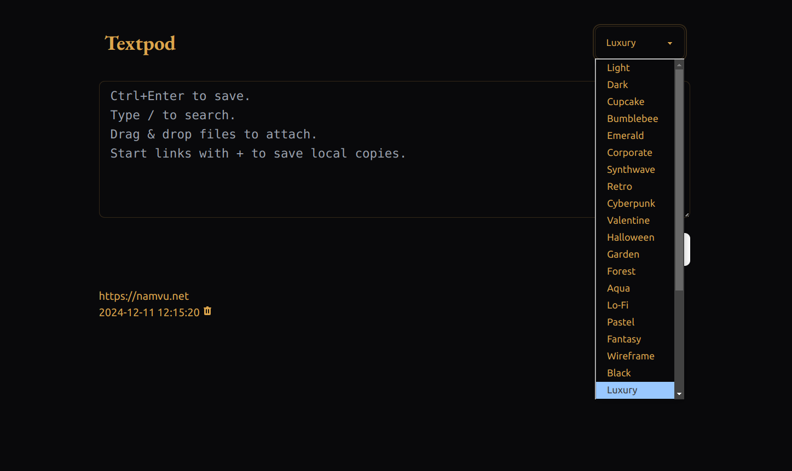

[](https://github.com/freetonik/textpod/actions?query=workflow%3AGNU%2FLinux)
[](https://github.com/freetonik/textpod/actions?query=workflow%3AmacOS)
[](https://github.com/freetonik/textpod/actions?query=workflow%3AWindows)

# Textpod

This is a fork of [freetonik/textpod](https://github.com/freetonik/textpod) but with a bunch of [DaisyUI](https://daisyui.com) themes. Textpod is a local-first web-based note-taking application built with Rust and modern web technologies.



## Features

- Markdown support with real-time preview
- Full-text search
- File attachments with automatic local copies
- Dark mode and multiple themes powered by [DaisyUI](https://daisyui.com)
- 30+ beautiful built-in themes including:
  - Light & Dark
  - Cupcake
  - Cyberpunk
  - Synthwave
  - Retro
  - Forest
  - And many more!
- Local-first: all data stored on your machine
- Fast and lightweight
- Responsive design

## Installation

### Option 1: Using Docker

The easiest way to run Textpod is using Docker:

```bash
docker run -d -p 3000:3000 -v $(pwd)/data:/app namvu87/textpod-daisyui:latest
```

Or using docker-compose:

```bash
git clone https://github.com/vnt87/textpod-daisyui.git
cd textpod-daisyui
docker-compose up -d
```

### Option 2: Building from source

1. Make sure you have Rust installed. If not, install it from [rustup.rs](https://rustup.rs/)
2. Clone this repository:
   ```bash
   git clone https://github.com/vnt87/textpod-daisyui.git
   cd textpod-daisyui
   ```
3. Build and run:
   ```bash
   cargo build
   cargo run
   ```
4. Open your browser and navigate to `http://localhost:3000`

## But...why though? Isn't Textpod meant to be dead simple?

Yes, but I'm a Product Designer by trade and I wanted to spice up the UI a bit. Also, you may have guessed but I'm also not a coder so I may have received some help from Claude with this integration.


## Contributing

Feel free to open issues and pull requests. I want to keep the code very simple and accessible to beginners. The goal is not to create another feature-rich note-taking app, but to keep it simple and fast.
A "one big text file" idea is very powerful and I just want to make it slightly enhanced.
